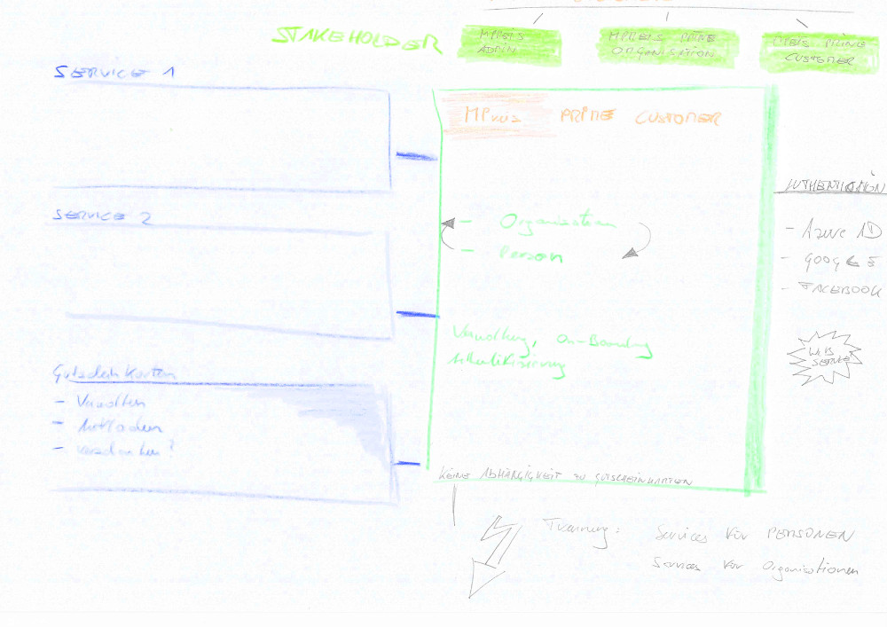

# coupon
Software zur Verwaltung von Gutscheinen und Gutscheinkarten.

Coupon ermöglicht die Selbstverwaltung von Gutscheinen- und Karten durch Organisationen und/oder Karteninhaber. Über ein Portal können Gutscheinkarten erstellt, verwaltet und geladen werden. Gutscheine lassen sich an Kassensystemen (POS) einlösen.

Das Projekt dient vorerst Demonstrationszwecken. Prototypisch wird eine mit MoWare erstellte Geschäftsanwendung anstatt als Desktop-Applikation im Internet als Portallösung bereit gestellt. Integration mit Dritt-Systemen (Web-Services) sind angedacht. 

Durch den Aufbau des Projektes werden vor allem 

* gängige MoWare Commands & Patterns illustriert
* Konfiguration und verschiedene Runtime-Platformen     
* TestDaten & TestCases

Zur Diskussion zu stellen sind vor allem noch Anforderungen durch den Anwender / anwendende Organisation selbst. Gerade deren Feedback und Requirements in Bezug auf die Verwaltung von Gutscheinen und Personen sind systematisch zu integrieren. 

# Aufbau und Ueberlegungen

